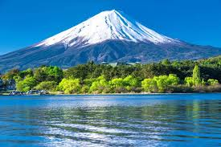
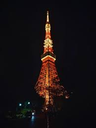

# Ex04 Places Around Me
## Date: 12/12/2025

## AIM
To develop a website to display details about the places around my house.

## DESIGN STEPS

### STEP 1
Create a Django admin interface.

### STEP 2
Download your city map from Google.

### STEP 3
Using ```<map>``` tag name the map.

### STEP 4
Create clickable regions in the image using ```<area>``` tag.

### STEP 5
Write HTML programs for all the regions identified.

### STEP 6
Execute the programs and publish them.

## CODE
``` HOME PAGE
<!DOCTYPE html>
<html lang="en">
<head>
    <meta charset="UTF-8">
    <meta name="viewport" content="width=device-width, initial-scale=1.0">
    <title>Home Page</title>
</head>
<body>
    <!-- Image Map Generated by http://www.image-map.net/ -->


<map name="image-map">
    <area target="" alt="Mountain Fuji " title="Mountain Fuji " href="mount.html" coords="363,404,517,489" shape="rect">
    <area target="" alt="Tokyo tower" title="Tokyo tower" href="tower.html" coords="786,343,84" shape="circle">
    <area target="" alt="Cherry Blossom Tree" title="Cherry Blossom Tree" href="hitachi.html" coords="968,10,960,11,945,40,950,75,1065,102,1028,51,1135,58,1075,0,1007,0,969,5,968,10" shape="poly">
</map>
</body>
</html>

MOUNT FUJI
<!DOCTYPE html>
<html lang="en">
<head>
    <meta charset="UTF-8">
    <meta name="viewport" content="width=device-width, initial-scale=1.0">
    <title>Mount Fuji</title>
</head>
<body bgcolor="LightSkyBlue" text="green">
    <center>
    
    <p>Mount Fuji is Japan’s tallest and most famous mountain, standing at 3,776 meters. It is a stratovolcano located on Honshu Island, about 100 km from Tokyo. Known for its perfectly symmetrical cone shape, Mount Fuji is considered a symbol of Japan and is often featured in art, photography, and literature.

The mountain is also a sacred site in Japanese culture, with many pilgrims and tourists climbing it during the official climbing season in summer. Surrounding it are beautiful lakes, forests, and shrines, making it a major natural and cultural landmark.</p>
   </center> 
</body>
</html>

TOKYO TOWER
<!DOCTYPE html>
<html lang="en">
<head>
    <meta charset="UTF-8">
    <meta name="viewport" content="width=device-width, initial-scale=1.0">
    <title>Tokyo tower</title>
</head>
<body bgcolor="Crimson" text="yellow">
    <center>
    
    <p>Tokyo Tower is a famous landmark in Tokyo, Japan, built in 1958 and standing 333 meters tall. Its design is inspired by the Eiffel Tower, but it is lighter and painted bright orange and white to meet safety rules. The tower is used for broadcasting TV and radio signals and is a major tourist spot. It has two observation decks that offer wide views of the city, and the base building, called FootTown, includes shops, museums, and restaurants. At night, the tower is beautifully lit, making it one of Tokyo’s most recognizable symbols.</p>
    </center>
</body>
</html>

CHERRY BLOSSOM TREE 
<!DOCTYPE html>
<html lang="en">
<head>
    <meta charset="UTF-8">
    <meta name="viewport" content="width=device-width, initial-scale=1.0">
    <title>Cherry Blossom Tree</title>
</head>
<body bgcolor="LightPink" text="purple">
    <center>
    
    <p>Hitachi Seaside Park in Japan offers a beautiful cherry blossom experience, especially along its river areas where pink petals line the paths. During spring, the park becomes a popular spot for leisurely walks, cycling, picnics, and taking photos of the vibrant flowers. Visitors enjoy the calm atmosphere, scenic views, and the mix of cherry blossoms with other seasonal blooms, making it one of Japan’s most relaxing outdoor spots.</p>
    </center>
</body>
</html>
```

## OUTPUT
 
 
 


## RESULT
The program for implementing image maps using HTML is executed successfully.
